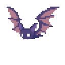

<!--- 
  --->

 

<h1 align="center">  Hello, &lt;coders/&gt;! 🌱  I'm Akash Soni. 💫</h1>
<h3 align="center">A Growing Developer.</h3>

    

#

<h1 align="center">
  Let's Connect and have a Chat! 💬
</h1>
  

    &nbsp;&nbsp;
    &nbsp;&nbsp;
    &nbsp;&nbsp;
    

    

    
    
    
        
    
    
     

    

 

-   🌱 I’m currently learning **C++ & Java for better development of my skills.**

<h2 align="center">Challenge me on:  
<a href="https://www.chess.com/member/aakash7878">&nbsp;&nbsp;
</h2>

<!--   -->
<!--   -->
 
<!--   -->
 

**𝙻𝙰𝙽𝙶𝚄𝙰𝙶𝙴𝚂 𝙰𝙽𝙳 𝚃𝙾𝙾𝙻𝚂:**

<code></code>
<code></code>
<code></code>
<code></code>
<code></code>
<code></code>
<code></code>
<code></code>
<code></code>
<code></code>
<code></code>
<code></code>
<code></code>

<code></code>
<code></code>
<code></code>
<code></code>
<code></code>
<code></code>
<code></code>
<code></code>
<code></code>
<code></code>
<code></code>
<code></code>

**OS Stack:**&nbsp;&nbsp;
<code></code>
<code></code>
<code></code>
<code></code>
<code></code>

    

    

    

#

  <g-emoji class="g-emoji" alias="chart_with_upwards_trend" fallback-src="https://github.githubassets.com/images/icons/emoji/unicode/1f4c8.png">📈</g-emoji>
  <strong>𝙶𝚒𝚝𝚑𝚞𝚋 𝚂𝚝𝚊𝚝𝚜 : </strong>

    
    <!---->
    
    

 

